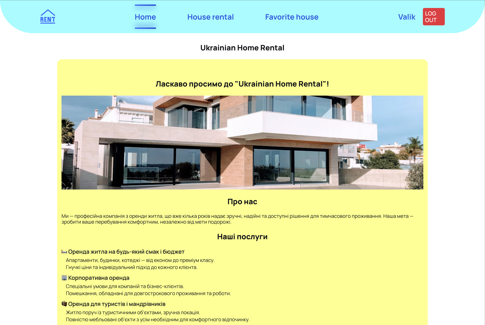

# 🏠 **Ukrainian Home Rental**

_A modern platform for finding and renting housing across Ukraine._

---

## 🧭 Site Structure

The site includes the following pages:

- **Home Page** — introduction and service overview  
  

- **All Properties Page** — browse all available homes and apartments  
  

- **Favorites Page** — view and manage your saved listings  
  

---

## ⚙️ Functionality

- 📄 View detailed information about each property  
  

- ❤️ Add properties to your favorites

- 🧭 Filter listings by type, location, price, and amenities  
  

- 🔄 Load more results to explore additional options

---

## 📱 Responsive Design

> The website is fully responsive and optimized for all devices, including mobile phones and tablets.

---

## 🛠️ Technologies Used

- **React**
- **Redux**
- **Axios** for API requests
- **CSS Modules / TailwindCSS**
- Deployed on **Netlify**

---

## 🔗 Useful Links

- 🌐 **Live Demo:** [Ukrainian Home Rental](https://your-home-rental.netlify.app/)  

---

## 🏡 Find your home away from home

> **_Comfort. Flexibility. Simplicity._**

---

[↑ Back to top](#start)

